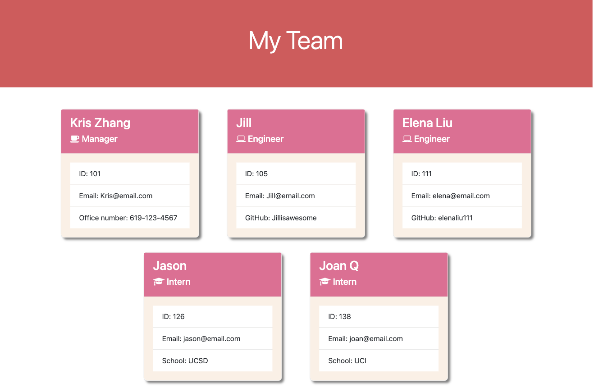

# Team Profile Generator 💻

## Table of Contents

- [Table of Contents](#table-of-contents)
- [Description](#description)
- [Installation](#installation)
- [Screenshot for generated webpage](#screenshot-for-generated-webpage)
- [Walkthrough Video](#walkthrough-video)
- [Questions](#questions)

## Description 
- As a manager, he/she wants to generate a webpage that displays my team's basic info. So that he/she can have quick access to their emails and GitHub profiles. 
- This Node.js command-line application that takes in information about employees on a software engineering team, then generates an HTML webpage that displays summaries for each person. 

## Installation
- Node.js is required to be installed, in order to run this command-line application. 

## Screenshot for generated webpage

## Walkthrough Video
- [URL for Walkthrough Video](https://drive.google.com/file/d/1De530hOstSk0DA1Vp0f6dGtcIZ-37qeV/view?usp=sharing)

## Questions
- For more projects, please visit my [GitHub](https://github.com/elenaliu0415). 
- Please feel free to contact me at elenaliu0415@gmail.com
